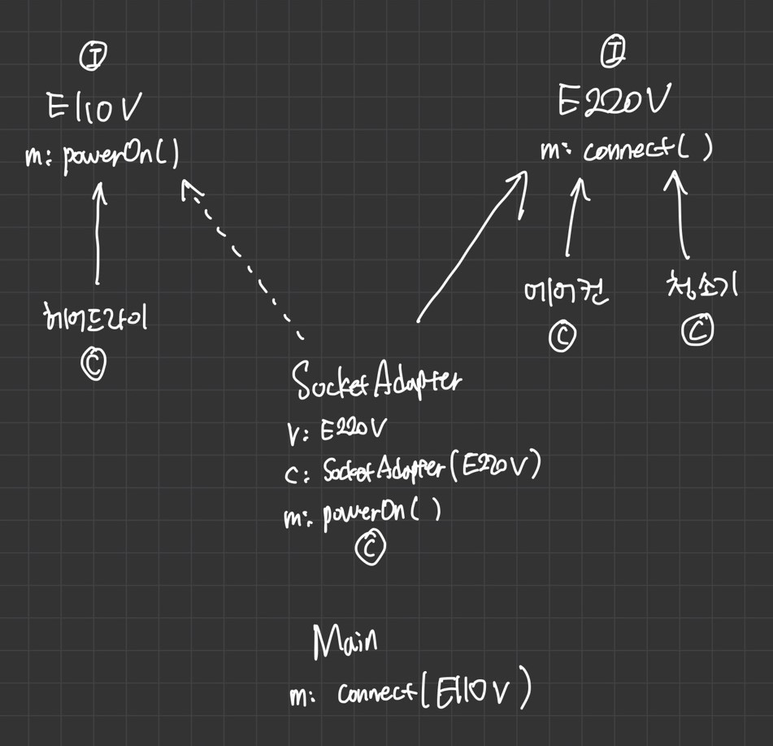

# Adapter pattern

Adapter는 실생활에서는 110v를 220v로 변경해주거나, 그 반대로 해주는 흔히 돼지코 라고 불리는 변환기를 예로 들 수 있다.

호환성이 없는 기존 클래스의 인터페이스를 변환하여 재사용 할 수 있도록 한다. SOLID 중에서 개방폐쇄 원칙(OCP)를 따른다.

즉, 어댑터 패턴은 클래스의 인터페이스를 사용자가 기대하는 인터페이스 형태로 변환시키는 패턴이다. 그리고 어댑터 패턴은 서로 일치하지 않는 인터페이스를 갖는 클래스들을 함께 동작시킨다.

## 예제코드

앞서 변환기와 돼지코를 예시를 들었으니 그에 맞는 예시 코드를 만들어보자.

일단 110V 와 220V 의  인터페이스를 정의해준다.

```java
// 110V 인터페이스
public interface Electronic110V {
    void powerOn();
}
```
```java
//220V 인터페이스
public interface Electronic220V {
    void connect();
}
```

그리고 해당 볼트에 맞는 제품들을 정의해준다. 예시로 헤어드라이, 에어컨, 청소기를 예로 들자.

```java
public class HairDryer implements Electronic110V{
    @Override
    public void powerOn() {
        System.out.println("헤어드라이기 110V on");
    }
}

public class AirConditioner implements Electronic220V{
    @Override
    public void connect() {
        System.out.println("에어컨 220V on");
    }
}

public class Cleaner implements Electronic220V{
    @Override
    public void connect() {
        System.out.println("청소기 220V on");
    }
}
```
현재 헤어드라이(HairDryer) 제품은 110V 인터페이스의 추상메소드를 구현하고 있고, 나머지 에어컨(AirConditioner), 청소기(Cleaner)는 220V 인터페이스의 추상메소드를 구현하고 있다.
**즉, 헤어드라이는 110V를 에어컨과 청소기는 220V로 서로 다른 인터페이스를 가지고 있다.**

이제 여기서 콘센트를 연결해서 결과를 보여주는 메소드를 정의하고 어떻게 실행되는지 결과증명 코드를 작성해보자.

```java
ublic class AdapterValidation {
    
    // 콘센트
    public static void connect(Electronic110V electronic110V){
        electronic110V.powerOn();
    }

    public static void main(String[] args) {
        HairDryer hairDryer = new HairDryer();
        connect(hairDryer);  // result : "헤어드라이기 110V on"
    }
}
```

위의 코드와 같이 테스트 클래스를 만들고 그 안에 콘센트 연결 메소드를 만들어서 헤어드라이를 연결해봤다. <br/>
이러면 결과는 "헤어드라이기 110V on" 으로 예상했던 정상적인 값이 나와 주었다.

그렇다면 다음 청소기를 해당 콘센트 연결 메소드에 넣어보자.

```java
ublic class AdapterValidation {
    
    // 콘센트
    public static void connect(Electronic110V electronic110V){
        electronic110V.powerOn();
    }

    public static void main(String[] args) {
        HairDryer hairDryer = new HairDryer();
        connect(hairDryer);  // result : "헤어드라이기 110V on"

        //추가
        Cleaner cleaner = new Cleaner();
        connect(cleaner); // COMPILE ERROR
    }
}
```

위에 코드에서 cleaner 변수로 청소기를 만들고 콘센트에 연결하려고 했는데 프러그램 실행도 전에 컴파일 에러가 난다. <br/>
당연한 결과다. 현재 연결동작을 하는 connect() 메소드는 파라미터를 110V 인터페이스로 받고 있는데 청소기는 220V 인터페이스로 구현되어있지 않은가.<br/>
물론 서로 다른 메소드를 계속 만들어서 구현 할 수 있지만 현재 상황에서 **클라이언트의 요구사항이 한 동작만을 통해서 다른 볼트의 제품을 연결하고 싶으면 어떻게 해야할까?**
그러면 이럴때 **Adapter 패턴을 활용**해서 변환기를 만들어 보자.

```java
public class SocketAdapter implements Electronic110V{
    private Electronic220V electronic220V;

    public SocketAdapter(Electronic220V electronic220V){
        this.electronic220V = electronic220V;
    }

    @Override
    public void powerOn() {
        electronic220V.connect();
    }
}
```
위 코드의 `SocketAdapter`는 220V를 110볼트로 변환해줄수 있게 하는 마치 돼지코/변환기 같은 존재다. 쉽게 설명하기 위해서 돼지코라 하겠다.

클래스 설명을 한 번 해보자면, <br/>

현재 `SocketAdapter`는 110V 인터페이스를 구현하고 있다. <br/>
-> 돼지코의 Out은 110V이다.

`SocketAdapters`의 생성자는 220V 인터페이스를 받고 전역에 선언된 220V 변수를 초기화 해준다. <br/>
-> 돼지코의 In은 220V이다. 

110V 인터페이스의 추상메소드 `powerOn()`을 초기화된 220V의 `connect()` 메소드를 호출해주는 코드를 작성해준다.<br/>
-> 돼지코의 110V를 연결하면 220V의 결과가 나온다.

그러면 실제 코드를 통해서 결과를 확인해보자
```java
public class AdapterValidation {
    
    // 콘센트
    public static void connect(Electronic110V electronic110V){
        electronic110V.powerOn();
    }

    public static void main(String[] args) {
        HairDryer hairDryer = new HairDryer();
        connect(hairDryer);

        Cleaner cleaner = new Cleaner();
        //connect(cleaner); //ERROR

        // 110V <- 변환기 <- 220V 청소기
        Electronic110V adapter = new SocketAdapter(cleaner);
        connect(adapter); // result : 청소기 220V on

        AirConditioner airConditioner = new AirConditioner();
        // 110V <- 변환기 <- 220V 에어컨
        adapter = new SocketAdapter(airConditioner);
        connect(adapter); // result : 에어컨 220V on
    }
}
```

모든 제품이 Adapter를 통해서 정상적인 결과를 도출한 것을 확인 할 수 있다.

보다 쉽게 이해하기 위해 클래스 다이아그램으로도 표현해보자.




이렇듯 Adapter pattern 을 사용하면 이렇게 서로 다른 인터페이스를 갖는 클래스를 함께 동작 할 수 있게 된다.

Adapter pattern은 크게 **두가지 방식**으로 구현된다.
1. **Class Adapter** : 자바의 상속(Inheritance)을 이용한 방법.
2. **Object Adapter** : 자바의 합성(Composite)을 이용한 방법.

위의 예시 코드들은 Object Adapter 방식으로 구현한 것에 굉장히 가깝다.

Class Adapter와 Object Adapter 코드 방식을 확인 하고 싶다면 아래의 자료를 확인해보자.

- [**@See All Directories**](./differ)
- [Class Adapter](./differ/SocketClassAdapterImpl.java)
- [Object Adapter](./differ/SocketObjectAdapterImpl.java)
- [Check Test Code](./differ/AdapterPatternTest.java)

이 Adapter pattern은 Java의 JDK 안에서 Arrays.asList()나 InputStreamReader(InputStream), OutputStreamWriter(OutputStream) 등에서 사용되었다. 

## 참고

- https://readystory.tistory.com/125
- https://niceman.tistory.com/141
